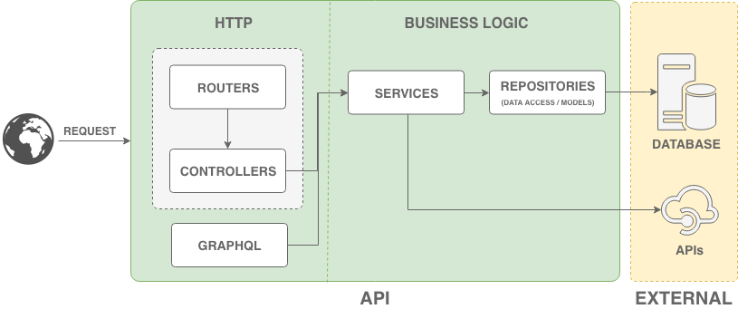

# Node API template
This is un list modular of template using the web framework Koa

## Architecture
Architecture diagram



<table>
    <thead>
        <tr>
            <th>Main layers</th>
            <th>Types</th>
            <th>What logic goes here?</th>
        </tr>
    </thead>
    <tbody>
        <tr>
            <td rowspan=2>HTTP logic layer</td>
            <td>Routes + Controllers</td>
            <td>
                <div>
                    <b>Routes:</b> 
                    Handle the HTTP requests that hits the API and route them to appropriate controller(s).
                </div>
                <div>
                    <b>Contollers:</b> 
                    Take request object, pull out data from request, validate, then send to service(s).
                </div>
            </td>
        </tr>
        <tr>
            <td>GraphQL</td>
            <td>
                Handle the HTTP request that hits the API by POST and pull out data from request, validate, then send to service(s).
            </td>
        </tr>
        <tr>
            <td>Business logic layer</td>
            <td>Services + Repositories</td>
            <td>
                <div>
                    <b>Services:</b>
                    Contains the business logic, derived from business and technical requirements, as well as how we access our repositories or external services.
                <div>
                    <b>Repositories:</b> 
                    Handle the connection to the database and provides the information needed by the service.
                </div>
            </td>
        </tr>
    </tbody>
</table>

## Project structure

This project is structured by modules or features

```
├── .vscode                               # VSCode configuration to debug
│   └── launch.json
├── dist                                  # Folder that contains the files needed by the distribution in the server.
├── node_modules                          # Folder that contains the project dependencies
├── reports                               # Inside the folder you will find the test, coverage and lint reports.
├── src                                   # Folder that contains the source code the API.
│   ├── bin                               # Inside that folder is the configuration to distribuite as executable.
│   │   ├── api
│   ├── modules                           # Folder that specifies the features the business.
│   │   ├── name                          # Folder that contains one feature the business.
│   │   │   ├── graphql                   # Folder that contains the GraphQL configuration.
│   │   │   │   ├── name.gql              # File that contains the types of GraphQL.
│   │   │   │   ├── name.graphql.js       # Create one GraphQL module configuration.
│   │   │   │   ├── name.mutation.js      # Specifies the methods to make transactions.
│   │   │   │   └── name.queries.js       # Specifies the methods to make queries.
│   │   │   ├── name.controller.js        # Validate the request and send to data to service.
│   │   │   ├── name.model.js             # Specified the model of business logic.
│   │   │   ├── name.repository.js        # Contains the methods to connect and provides the information the database.
│   │   │   ├── name.route.js             # Contains the verbs of an endpoint the REST API.
│   │   │   ├── name.schema.js            # Specifies the validations of attributes of a model.
│   │   │   └── name.service.js           # Inside this file your can do business rules.
│   ├── utils                             # Folder that especies the utils of project.
│   │   ├── api-docs.js                   # Handles the docs the api.
│   │   ├── api-error.js                  # Handles the errors the api.
│   │   ├── api-logger.js                 # Handles the log the api (access.log, error.log).
│   │   ├── api-not-favicon.js            # Disable the favicon.ico.
│   │   ├── compress.js                   # Handles the compression the all of requests the api.
│   │   ├── csp.js                        # Handles the security the api.
│   │   ├── docs.yml                      # Specifies the documentation the apis in the project.
│   │   ├── schema-validator.js           # Global configuration for schema validations.
│   │   └── ...
│   ├── graphql.js                        # Global configuration to join the GraphQL modules.
│   ├── routes.js                         # Global configuration to join the Routes modules.
│   └── server.js                         # Global configuration to create an Http Server.
├── test                                  # Folder that contains the test source code.
│   ├── unit                              # Folder that contains the unit test.
│   └── integration                       # Folder that contains the integration test.
├── .babelrc.js                           # Global configuration to allow ES6/ES7/ES8
├── .dockerignore                         # Global configuration to not upload certain files in docker image.
├── .editorconfig                         # Global configuration that specified the format rules.
├── .eslintignore                         # Global configuration to not validate certain files.
├── .eslintrc.yml                         # Global configuration that specified the lint rules.
├── .gitignore                            # Global configuration to not upload certain files.
├── .prettierrc                           # Global configuration that specified the format rules.
├── Dockerfile                            # Global configuration to create docker image.
├── env.yaml                              # Global configuration the different environments.
├── gulpfile.js                           # Define tasks for the project. Example: compress, minify
├── LICENSE                               # Specified the MIT License.
├── nodemon.json                          # Global configuration to allow hot reloading. 
├── package.json                          # Global configuration the different dependencies of the Project.
├── pm2.yml                               # Global configuration to deploy app in production.
└── README.md                             # Specified the description the Project.
```